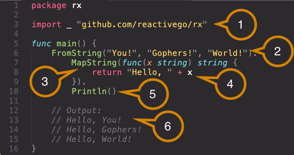

# Generics for Go
[](http://godoc.org/github.com/reactivego/generics)

Generics for Go generates strongly typed Go code by expanding generic templates from a library.

A template is a piece of generic code with type place-holders. Template expansion then replaces type place-holders with concrete types. This creates a strongly typed version of a generic algorithm.

Because generics are not supported by Go, a [tool](cmd/jig) to generate code is needed. Install it as follows:

`go get github.com/reactivego/generics/cmd/jig`

## Example

Let's implement a generic stack.

We start with two templates that use `foo` as a type place-holder:

```go
package stack

type foo int

//jig:template <Foo>Stack

type FooStack []foo
var zeroFoo foo

//jig:template <Foo>Stack Push

func (s *FooStack) Push(v foo) {
  *s = append(*s, v)
}
```
Note that this library contains **valid** Go code that compiles normally.

This code is [online](example/stack/generic) and can be imported as follows:

```go
import _ "github.com/reactivego/generics/example/stack/generic"
```

Given some code that uses this Library in a file `main.go`.

```go
package main

import _ "github.com/reactivego/generics/example/stack/generic"

func main() {
  var stack StringStack
  stack.Push("Hello, World!")
}
```
Running `jig` will expand the two templates and write them to the file `stack.go`.

```go
// Code generated by jig; DO NOT EDIT.

//go:generate jig

package main

//jig:name StringStack

type StringStack []string
var zeroString string

//jig:name StringStackPush

func (s *StringStack) Push(v string) {
  *s = append(*s, v)
}
```
The generated code is a type-safe stack generated by expanding templates for the type `string`

# Quick Start

In this Quick Start you will learn to write a minimal program that uses generics. The generator tool **`jig`** will generate code from the generics library **`rx`** ([Reactive eXtensions for Go](https://github.com/reactivego/rx)). The purpose of this is to showcase how to use a generics library in Go.
## Dependencies

You must to have Go [installed](https://golang.org/doc/install#install).

## Installation


To install `jig` and `rx`, open a terminal and from the command-line and run:

```bash
$ go get github.com/reactivego/generics/cmd/jig
$ go get github.com/reactivego/rx
```

> Note the first line will install the `jig` command in your `GOPATH` bin directory and the second one will download `rx`.

To test whether `jig` was installed go to the command-line and run `jig -h`:

```bash
$ jig -h
Usage of jig [flags] [<dir>]:
  -c, --clean     Remove files generated by jig
  -r, --regen     Force regeneration of all code by jig (default)
  -m, --missing   Only generate code that is missing
  -v, --verbose   Print details of what jig is doing
```


## How it works

- You write code that references templates from the `rx` library.
- You run the `jig` command in the directory where your code is located.
- **Now `jig` analyzes your code and determines what additional code is needed to make it build**.
- *Jig* takes templates from the `rx` library and specializes them on specific types.
- Specializations are generated into the file `rx.go` alongside your own code.
- If all went well, your code will now build.

## Prepare Folder

Let's create a new folder for our simple program and start editing the file `main.go`.

```bash
$ cd $(go env GOPATH)
$ mkdir -p ./src/helloworld
$ cd ./src/helloworld
$ subl main.go
```
> NOTE we use `subl` to open *Sublime Text*, but any text editor will do.

## Write Code
Now that you have your [`main.go`](../example/rx/main.go) file open in your editor of choice, type the following code:



If you would now go to the command-line and run `jig` it would do the following:

1. Import `github.com/reactivego/rx/generic` to access the generics in that library.
2. Optionally specify the file to generate the code into.
3. Generate `FromStrings` by specializing the template `From<Foo>s` from the library on type `string`. Generate dependencies of `FromStrings` like the type `ObservableString` that is returned by `FromStrings`.
4. Generate the `MapString` method of `ObservableString` by specializing the template `Observable<Foo> Map<Bar>` for `Foo` as type `string` and `Bar` (the type to map to) also as type `string`.
5. Map function from `string` to `string` just concatenates two strings and returns the result.
6. Print every string returned by the Map function.
7. The output you can expect when you run the program.

Now actually go to the command-line and run `jig -v`. Use the verbose flag `-v` because otherwise `jig` will be silent.

```bash
$ jig -v
found 16 templates in package "multicast" (github.com/reactivego/multicast/generic)
found 114 templates in package "rx" (github.com/reactivego/rx/generic)
generating "FromStrings"
  StringObserveFunc
  ObservableString
  StringObserver
  CreateString
  FromSliceString
  FromStrings
generating "Scheduler"
  Scheduler
generating "Subscriber"
  Subscriber
generating "ObservableString MapString"
  ObservableString MapString
generating "ObservableString Println"
  NewScheduler
  SubscribeOptions
  ObservableString Subscribe
  ObservableString Println
writing file "rx.go"
```

Now we can try to run the code and see what it does.

```bash
$ go run *.go
Hello, You!
Hello, Gophers!
Hello, World!
```

Success! `jig` generated the code into the file `rx.go` and we were able to run the program.
Turns out the generated file [`rx.go`](example/rx/rx.go) contains less than 250 lines of code.

If you add additional code to the program that uses different generics of the `rx` library, then you should run `jig` again to generate specializations of those generics.

